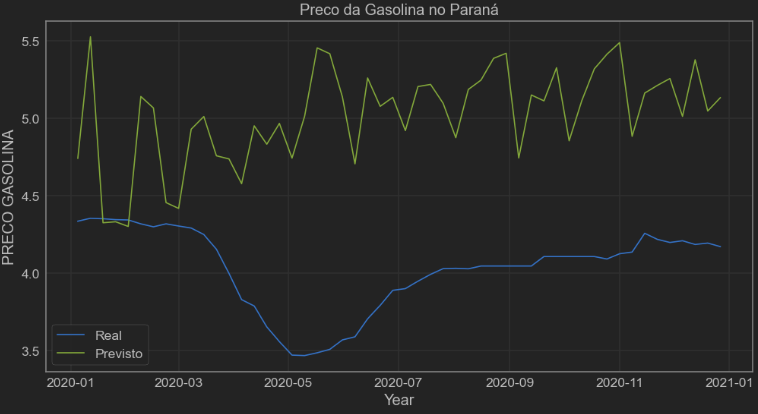
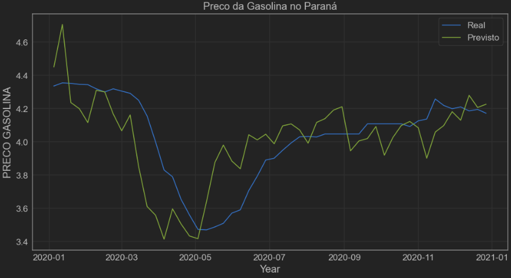
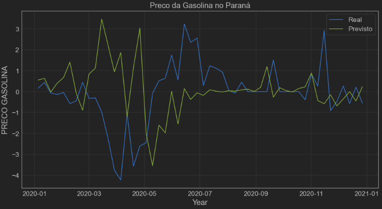

# Fuel Price Prediction

As part of a group project for the "Introduction to Data Science" course at the university, I was responsible for
analyzing how the COVID-19 pandemic affected fuel prices in Brazil. To accomplish this, I segmented the
data into pre-pandemic and pandemic periods. I then applied multiple linear regression, using relevant
variables (petroleum prices and exchange rates), to forecast fuel prices during the pandemic. Finally, I
compared the predicted prices with the actual data from 2020-2021, which was not used in training the model.

As you can see bellow (the blue line correspond to the real data and green line to the forecast):

Trained with data from 2004 to 2019.

Trained with data from 2017 to 2019.

Percentage differences.

The conclusion I reached was that, in the Brazilian lockdown, fuel prices fell sharply, driven by the price of oil and dollar.
